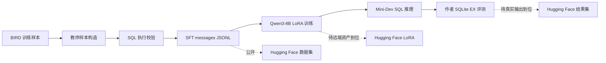

# 结构化 Text-to-SQL 蒸馏

[](https://github.com/craboy4/text-to-sql-struct-distillation)
[](https://huggingface.co/datasets/craboy4/text-to-sql-struct-distillation-sft)
[](https://huggingface.co/datasets/craboy4/text-to-sql-struct-distillation-minidev)
[](https://github.com/bird-bench/mini_dev)
[](https://huggingface.co/Qwen/Qwen3-8B)

本项目复现并整理了一个面向 BIRD 的结构化 Text-to-SQL 蒸馏流程：从教师样本构造、SFT 数据导出、Qwen3-8B LoRA 训练，到 Mini-Dev 推理和作者 SQLite Execution Accuracy (EX) 评测。工程边界参考 [Struct-SQL-Distillation](https://github.com/craterlabs/Struct-SQL-Distillation)，评测口径采用 [BIRD Mini-Dev](https://github.com/bird-bench/mini_dev) 的作者实现。

> **公开资产：** [完整 SFT（6,246 条）及正式 DB-dev4 训练 split（5,160 条）](https://huggingface.co/datasets/craboy4/text-to-sql-struct-distillation-sft) 和 [Mini-Dev 派生 SFT（500 条）](https://huggingface.co/datasets/craboy4/text-to-sql-struct-distillation-minidev) 已发布到 Hugging Face。最佳 LoRA adapter 和真实推理输出会在从远端训练机取得并核验后按版本补充。

---

## 项目概览



### 核心方法

- **结构化教师信号：** 每个样本要求 Schema Linking、Query Plan 和可执行 SQLite SQL 三段式输出，而不是无约束的自由推理。
- **执行导向的数据构造：** 教师输出经过 SQL 解析与执行校验后再导出为 Qwen messages 格式。
- **可复现的训练与评测边界：** 训练配置、提示词构造、预测格式适配和作者 EX 评测脚本均在本仓库管理；原始 BIRD 数据库、gold SQL 和大型权重不进入 Git。

---

## 已验证结果

评测使用 BIRD Mini-Dev SQLite 的 500 道题目和作者集合型 Execution Accuracy (EX) 定义。

| 模型 | 训练状态 | EX | 正确数 |
| --- | --- | ---: | ---: |
| Qwen3-8B | 初始模型 | 41.80% | 209 / 500 |
| **Qwen3-8B + LoRA checkpoint-969** | **DB-dev4 SFT，3 epoch** | **50.40%** | **252 / 500** |

相较初始 Qwen3-8B，最佳 checkpoint 在该口径上提升 **8.60 个百分点**。详细约束和结果解释见 [评测说明](docs/评测说明.md)。

---

## 资产发布

| 资产 | 位置 | 发布状态 |
| --- | --- | --- |
| 完整 SFT messages | [Hugging Face 数据集](https://huggingface.co/datasets/craboy4/text-to-sql-struct-distillation-sft) | 已发布，6,246 条 |
| 正式 DB-dev4 训练 split | [同一数据集的 `dbdev4_train_5160.jsonl`](https://huggingface.co/datasets/craboy4/text-to-sql-struct-distillation-sft/tree/main/splits) | 已发布，5,160 条 |
| DB-dev4 execution-dev | [同一数据集的 `dbdev4_execution_dev_prompts_400.jsonl`](https://huggingface.co/datasets/craboy4/text-to-sql-struct-distillation-sft/tree/main/splits) | 已发布，4 个保留数据库各 100 条，无 gold SQL |
| Mini-Dev 派生 SFT | [Hugging Face 数据集](https://huggingface.co/datasets/craboy4/text-to-sql-struct-distillation-minidev) | 已发布，500 条 |
| Qwen3-8B LoRA `checkpoint-969` | [Hugging Face 模型](https://huggingface.co/craboy4/qwen3-8b-bird-lora-dbdev4) | 远端约 501 MB adapter 待获取 |
| 预测与作者 EX 输出 | [Hugging Face 结果集](https://huggingface.co/datasets/craboy4/text-to-sql-struct-distillation-results) | 远端真实输出待获取 |

每项资产的来源、大小、远端路径和发布边界记录在 [资产清单](docs/资产清单.md)。不会公开 BIRD SQLite 数据库、gold SQL、未确认许可证的原始数据或任何 API 凭据。

---

## 代码结构

```text
BIRD/
├── teacher_generation/       # 教师调用、SQL 执行校验、SFT 样本导出
├── training/                 # SFT、推理、提示词构造和本地评测
├── evaluation/author_minidev/# BIRD Mini-Dev 作者 EX 脚本副本
├── configs/sft/              # 可复现训练配置
├── scripts/                  # 远端运行和格式适配脚本
├── hf_release/               # Hugging Face 数据/模型/结果卡
└── docs/                     # 中文文档、资产清单和评测记录
```

## 快速复现

### 1. 导出 SFT 数据

在已准备好教师样本及其执行校验结果的环境中：

```bash
cd ..
python BIRD/teacher_generation/export_qwen_sft.py
```

生成的 JSONL 不提交到 Git，应发布到对应的 Hugging Face 数据集仓库并附带数据卡和哈希。

### 2. 启动 Qwen3-8B LoRA SFT

远端训练环境配置为 Qwen3-8B、LoRA rank 16、learning rate `5e-5`、最大长度 32,768、3 epoch：

```bash
bash training/start_sft_3epoch_dbdev.sh
```

当前已验证训练集为从完整 SFT 按数据库划分出的 DB-dev4 SFT，共 5,160 条。4 个保留数据库各抽取 100 条构成 400 条 execution-dev，`works_cycles` 因长上下文单独剔除；完整划分和哈希见数据集卡。训练命令未再从 5,160 条中随机切 validation-loss 集。完整配置见 [qwen3_8b_bird_lora_3epoch_dbdev4.yaml](configs/sft/qwen3_8b_bird_lora_3epoch_dbdev4.yaml)。

### 3. 推理与作者 EX 评测

```bash
python training/run_minidev_local.py \
  --model <Qwen3-8B_基座目录> \
  --adapter <checkpoint-969_目录> \
  --prompts <minidev_messages.jsonl> \
  --output <predictions.jsonl> \
  --batch-size 8

bash scripts/evaluate_author_minidev.sh \
  <predictions.jsonl> \
  <evaluation_output_dir>
```

评测脚本会以 500 题为固定分母；缺失预测以空 SQL 计错，避免因只评估部分样本而虚高分数。

---

## 数据与评测边界

- BIRD Mini-Dev 数据库和 gold SQL 必须从上游数据包取得，不能以本仓库内容替代。
- BIRD Mini-Dev 派生的公开数据按 `CC BY-SA 4.0` 发布并保留 BIRD 署名。
- Qwen3-8B 基座约 19 GB、最佳 LoRA adapter 约 501 MB；两者均不进入普通 Git。
- 作者 EX 使用集合比较并忽略重复行，不能与多重集比较的分数直接混用。

## 引用

```bibtex
@inproceedings{li2024bird,
  title={Can LLM Already Serve as A Database Interface? A BIg Bench for Large-Scale Database Grounded Text-to-SQLs},
  author={Li, Jinyang and others},
  year={2024}
}
```

## 致谢

本项目的工程组织参考 [craterlabs/Struct-SQL-Distillation](https://github.com/craterlabs/Struct-SQL-Distillation)，Mini-Dev 基准和作者评测实现来自 [bird-bench/mini_dev](https://github.com/bird-bench/mini_dev)。
