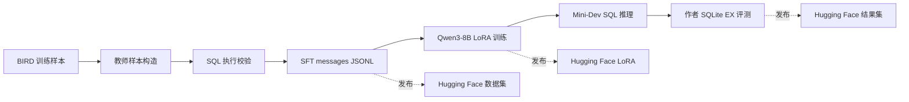

# 结构化 Text-to-SQL 蒸馏

[](https://github.com/craboy4/text-to-sql-struct-distillation)
[](https://huggingface.co/datasets/craboy4/text-to-sql-struct-distillation-sft)
[](https://huggingface.co/datasets/craboy4/text-to-sql-struct-distillation-minidev)
[](https://github.com/bird-bench/mini_dev)
[](https://huggingface.co/Qwen/Qwen3-8B)

本项目复现并整理了一个面向 BIRD 的结构化 Text-to-SQL 蒸馏流程：从教师样本构造、SFT 数据导出、Qwen3-8B LoRA 训练，到 Mini-Dev 推理和作者 SQLite Execution Accuracy (EX) 评测。工程边界参考 [Struct-SQL-Distillation](https://github.com/craterlabs/Struct-SQL-Distillation)，评测口径采用 [BIRD Mini-Dev](https://github.com/bird-bench/mini_dev) 的作者实现。

> **公开资产：** [完整 SFT（6,246 条）及正式 DB-dev4 训练 split（5,160 条）](https://huggingface.co/datasets/craboy4/text-to-sql-struct-distillation-sft)、[Mini-Dev 派生 SFT（500 条）](https://huggingface.co/datasets/craboy4/text-to-sql-struct-distillation-minidev)、[Qwen3-8B LoRA checkpoint-969](https://huggingface.co/craboy4/qwen3-8b-bird-lora-dbdev4) 与 [真实预测及作者 EX 输出](https://huggingface.co/datasets/craboy4/text-to-sql-struct-distillation-results) 均已发布。

---

## 项目概览



### 核心方法

- **结构化教师信号：** 每个样本要求 Schema Linking、Query Plan 和可执行 SQLite SQL 三段式输出，而不是无约束的自由推理。
- **执行导向的数据构造：** 教师输出经过 SQL 解析与执行校验后再导出为 Qwen messages 格式。
- **可复现的训练与评测边界：** 训练配置、提示词构造、预测格式适配和作者 EX 评测脚本均在本仓库管理；原始 BIRD 数据库、gold SQL 和大型权重不进入 Git。

---

## 已验证结果

评测使用 BIRD Mini-Dev SQLite 的 500 道题目和作者集合型 Execution Accuracy (EX) 定义。

| 模型 | 训练状态 | 推理 prompt | EX | 正确数 |
| --- | --- | --- | ---: | ---: |
| Qwen3-8B | 初始模型 | 本项目构造的结构化 prompt | 41.80% | 209 / 500 |
| **Qwen3-8B + LoRA checkpoint-969** | **DB-dev4 SFT，3 epoch** | **本项目构造的结构化 prompt** | **50.40%** | **252 / 500** |

相较初始 Qwen3-8B，最佳 checkpoint 在该口径上提升 **8.60 个百分点**。详细约束和结果解释见 [评测说明](docs/评测说明.md)。

---

## 资产发布

| 资产 | 位置 | 发布状态 |
| --- | --- | --- |
| 完整 SFT messages | [Hugging Face 数据集](https://huggingface.co/datasets/craboy4/text-to-sql-struct-distillation-sft) | 已发布，6,246 条 |
| 正式 DB-dev4 训练 split | [同一数据集的 `dbdev4_train_5160.jsonl`](https://huggingface.co/datasets/craboy4/text-to-sql-struct-distillation-sft/tree/main/splits) | 已发布，5,160 条 |
| DB-dev4 execution-dev | [同一数据集的 `dbdev4_execution_dev_prompts_400.jsonl`](https://huggingface.co/datasets/craboy4/text-to-sql-struct-distillation-sft/tree/main/splits) | 已发布，4 个保留数据库各 100 条，无 gold SQL |
| Mini-Dev 派生 SFT | [Hugging Face 数据集](https://huggingface.co/datasets/craboy4/text-to-sql-struct-distillation-minidev) | 已发布，500 条 |
| Qwen3-8B LoRA `checkpoint-969` | [Hugging Face 模型](https://huggingface.co/craboy4/qwen3-8b-bird-lora-dbdev4) | 已发布，标准 PEFT LoRA 权重及配置 |
| 预测与作者 EX 输出 | [Hugging Face 结果集](https://huggingface.co/datasets/craboy4/text-to-sql-struct-distillation-results) | 已发布，498 条原始预测、500 题作者格式输出与 EX 日志 |

每项资产的来源、大小、远端路径和发布边界记录在 [资产清单](docs/资产清单.md)。不会公开 BIRD SQLite 数据库、gold SQL、未确认许可证的原始数据或任何 API 凭据。

---

## 代码结构

```text
BIRD/
├── teacher_generation/       # 教师调用、SQL 执行校验、SFT 样本导出
├── training/                 # SFT、推理、提示词构造和本地评测
├── evaluation/author_minidev/# BIRD Mini-Dev 作者 EX 脚本副本
├── configs/sft/              # 可复现训练配置
├── scripts/                  # 远端运行和格式适配脚本
├── hf_release/               # Hugging Face 数据/模型/结果卡
└── docs/                     # 中文文档、资产清单和评测记录
```

## 从零复现

### 1. 克隆代码并创建工作目录

以下命令假设 Linux GPU 机器。代码仓库放在 `PROJECT_ROOT/BIRD`，而模型、数据、输出放在 `PROJECT_ROOT` 下，避免大文件进入 Git。

```bash
export PROJECT_ROOT=/data/text2sql_qwen3
git clone https://github.com/craboy4/text-to-sql-struct-distillation.git "$PROJECT_ROOT/BIRD"
cd "$PROJECT_ROOT/BIRD"

python -m pip install -U huggingface_hub
python -m pip install torch transformers peft accelerate ms-swift
```

训练需要 CUDA、PyTorch、`ms-swift` 和足够的显存/磁盘；作者 EX 评测的 Python 依赖以 BIRD Mini-Dev 上游 `requirements.txt` 为准。仓库的 [preflight.py](training/preflight.py) 会在启动训练前检查数据、模型和运行环境。默认检查针对本实验的远端镜像及 Blackwell GPU；迁移到其他硬件时应先调整并记录对应环境检查。

### 2. 从 Hugging Face 获取本项目数据

本项目公开的数据集不包含 BIRD 的 SQLite 数据库或 gold SQL。下面的命令下载完整 SFT、正式训练 split、execution-dev 提示词和 Mini-Dev 派生 SFT：

```bash
export PROJECT_ROOT=/data/text2sql_qwen3
python - <<'PY'
import os
from huggingface_hub import snapshot_download

root = os.environ["PROJECT_ROOT"]
snapshot_download(
    repo_id="craboy4/text-to-sql-struct-distillation-sft",
    repo_type="dataset",
    local_dir=f"{root}/hf/sft",
)
snapshot_download(
    repo_id="craboy4/text-to-sql-struct-distillation-minidev",
    repo_type="dataset",
    local_dir=f"{root}/hf/minidev_sft",
)
PY

mkdir -p "$PROJECT_ROOT/data"
cp "$PROJECT_ROOT/hf/sft/splits/dbdev4_train_5160.jsonl" \
  "$PROJECT_ROOT/data/qwen_sft_messages_train_dbdev4.jsonl"
```

| 文件 | 用途 | 是否用于已报告的 8B 训练 |
| --- | --- | --- |
| `qwen_sft_messages.jsonl` | 全量结构化 SFT，6,246 条 | 否，仅作为完整公开导出 |
| `splits/dbdev4_train_5160.jsonl` | 正式训练集，5,160 条 | 是 |
| `splits/dbdev4_execution_dev_prompts_400.jsonl` | 四个保留数据库各 100 条的 execution-dev 提示词 | 用于独立开发/检查，不进入训练 |
| `minidev_sft_messages.jsonl` | 500 条 Mini-Dev 派生 SFT | 不用于已报告的 8B 训练 |

完整数据卡、划分规则和 SHA-256 位于 [SFT 数据集页面](https://huggingface.co/datasets/craboy4/text-to-sql-struct-distillation-sft)。下载后可校验正式训练 split：

```bash
sha256sum "$PROJECT_ROOT/data/qwen_sft_messages_train_dbdev4.jsonl"
# 1e46c2a8f6e8d8db69660ba0a8bc98d7fe8de96bd75da8c9a1af31d1afcd934f
```

### 3. 从 BIRD 上游获取 Mini-Dev 数据库和评测材料

SQLite 数据库、问题、gold SQL 及作者提示词不在本项目或本项目的 Hugging Face 仓库中。请遵守上游许可，从 [bird-bench/mini_dev](https://github.com/bird-bench/mini_dev) 或其 README 所列的完整数据包下载；下面以仓库克隆为例。

```bash
export PROJECT_ROOT=/data/text2sql_qwen3
git clone https://github.com/bird-bench/mini_dev.git "$PROJECT_ROOT/third_party/mini_dev"
python -m pip install -r "$PROJECT_ROOT/third_party/mini_dev/requirements.txt"

mkdir -p "$PROJECT_ROOT/eval"
cp -a "$PROJECT_ROOT/third_party/mini_dev/minidev/MINIDEV" "$PROJECT_ROOT/eval/MINIDEV"
```

完成后必须能找到以下文件；本仓库的评测脚本据此执行 500 道 SQLite 题目：

```text
$PROJECT_ROOT/eval/MINIDEV/
├── mini_dev_sqlite.json
├── mini_dev_sqlite_gold.sql
└── dev_databases/                 # 11 个 SQLite 数据库目录
```

为复用作者 EX 评测，准备一个只放评测脚本和作者 prompt 的目录。这里复制的是本仓库固定版本的评测脚本，并使用刚下载的上游 prompt：

```bash
export EVALUATOR_DIR="$PROJECT_ROOT/evaluation_upstream_minidev"
mkdir -p "$EVALUATOR_DIR"
cp "$PROJECT_ROOT/BIRD/evaluation/author_minidev/evaluation_ex.py" "$EVALUATOR_DIR/"
cp "$PROJECT_ROOT/BIRD/evaluation/author_minidev/evaluation_utils.py" "$EVALUATOR_DIR/"
cp "$PROJECT_ROOT/BIRD/training/prepare_author_ex_predictions.py" "$EVALUATOR_DIR/"
cp "$PROJECT_ROOT/third_party/mini_dev/finetuning/inference/mini_dev_prompt.jsonl" "$EVALUATOR_DIR/"
```

### 4. 获取 Qwen3-8B 基座并训练 LoRA

```bash
export PROJECT_ROOT=/data/text2sql_qwen3
python - <<'PY'
import os
from huggingface_hub import snapshot_download
snapshot_download(
    repo_id="Qwen/Qwen3-8B",
    local_dir=f"{os.environ['PROJECT_ROOT']}/models/Qwen3-8B",
)
PY
```

编辑 [training/env.sh](training/env.sh)，把其中的 `PROJECT_ROOT`、Python 路径和缓存路径改为当前机器的真实路径。随后启动正式配置：

```bash
cd "$PROJECT_ROOT/BIRD"
bash training/start_sft_3epoch_dbdev.sh
```

该配置使用 Qwen3-8B、LoRA rank 16、learning rate `5e-5`、最大长度 32,768、3 epoch。训练数据是 5,160 条 `dbdev4_train_5160.jsonl`；训练命令显式设置 `split_dataset_ratio=0`，不会再从其中随机切出 validation-loss 数据。400 条 execution-dev 与训练集数据库不相交。完整参数见 [qwen3_8b_bird_lora_3epoch_dbdev4.yaml](configs/sft/qwen3_8b_bird_lora_3epoch_dbdev4.yaml)。

最佳 `checkpoint-969` 的标准 PEFT adapter 已发布到 [模型仓库](https://huggingface.co/craboy4/qwen3-8b-bird-lora-dbdev4)，可直接按模型卡加载；其 SHA-256 为 `8940b165798f62e7d13b978cc43646077db2a56e03c504c445e1b1e914dd4464`。

### 5. 生成 Mini-Dev 预测并运行作者 EX

先将 Mini-Dev 转成与 SFT 一致的 messages 格式，再用基座或刚训练完成的 adapter 生成回复：

```bash
export PROJECT_ROOT=/data/text2sql_qwen3
export RUN_DIR="$PROJECT_ROOT/outputs/minidev_checkpoint_969"
mkdir -p "$RUN_DIR"

cd "$PROJECT_ROOT/BIRD"
python training/prepare_minidev_inference.py prepare \
  --minidev-root "$PROJECT_ROOT/eval/MINIDEV" \
  --sft-dataset "$PROJECT_ROOT/data/qwen_sft_messages_train_dbdev4.jsonl" \
  --output "$PROJECT_ROOT/eval/minidev_sft_messages.jsonl"

python training/run_minidev_local.py \
  --model "$PROJECT_ROOT/models/Qwen3-8B" \
  --adapter "$PROJECT_ROOT/outputs/experiments/<训练运行目录>/checkpoint-969" \
  --prompts "$PROJECT_ROOT/eval/minidev_sft_messages.jsonl" \
  --output "$RUN_DIR/responses.jsonl" \
  --batch-size 8

python training/prepare_minidev_inference.py extract \
  --prompts "$PROJECT_ROOT/eval/minidev_sft_messages.jsonl" \
  --responses "$RUN_DIR/responses.jsonl" \
  --output "$RUN_DIR/predictions.jsonl"
```

最后将本仓库的 `question_id/sql` JSONL 适配为作者格式，并调用作者集合型 EX：

```bash
PROJECT_ROOT="$PROJECT_ROOT" \
EVALUATOR_DIR="$PROJECT_ROOT/evaluation_upstream_minidev" \
PYTHON_BIN=python \
bash scripts/evaluate_author_minidev.sh \
  "$RUN_DIR/predictions.jsonl" \
  "$RUN_DIR/author_ex"
```

结果写入 `$RUN_DIR/author_ex/author_ex.txt`。脚本始终以 500 题为分母，缺失预测会按空 SQL 计错，避免只评估部分样本造成分数虚高。对于作者原始 prompt 的对照实验，可使用 [prepare_author_minidev_prompts.py](training/prepare_author_minidev_prompts.py) 将上游 `mini_dev_prompt.jsonl` 包装为单个 user message。

### 6. 可选：从 BIRD 训练数据重新构造教师 SFT

公开的 6,246 条 SFT 足以复现本项目的训练；只有需要替换教师模型或重新做数据筛选时，才需要此步骤。此时还必须按 BIRD 上游许可取得训练集、训练数据库和列含义文件，并准备一个本地私有的 `teacher.env`：

```bash
# 不要把该文件提交、上传或粘贴到 issue 中
cat > "$PROJECT_ROOT/BIRD/teacher_generation/teacher.env" <<'EOF'
TEACHER_BASE_URL=https://<你的兼容 OpenAI 的服务地址>
TEACHER_API_KEY=<你的密钥>
TEACHER_MODEL=<教师模型名>
TEACHER_REASONING_EFFORT=high
EOF

cd "$PROJECT_ROOT"
python BIRD/teacher_generation/generate_teacher_data.py \
  --input BIRD/train_filtered/train.jsonl \
  --database-root BIRD/train/train_databases \
  --column-meanings BIRD/train_filtered/train_column_meaning.json \
  --output BIRD/teacher_generation/teacher_output.jsonl \
  --env-file BIRD/teacher_generation/teacher.env \
  --limit 10 \
  --workers 2
```

脚本会对教师 SQL 和 gold SQL 分别执行，并只将格式正确且执行结果等价的样本标记为 `ready_for_sft`。原始教师响应可能包含上游 SQL、执行输出或供应商信息，因此不应直接公开；公开发布前只导出经审查的 messages JSONL，并记录样本数和 SHA-256。

---

## 数据与评测边界

- BIRD Mini-Dev 数据库和 gold SQL 必须从上游数据包取得，不能以本仓库内容替代。
- BIRD Mini-Dev 派生的公开数据按 `CC BY-SA 4.0` 发布并保留 BIRD 署名。
- Qwen3-8B 基座约 19 GB、最佳 LoRA adapter 约 501 MB；两者均不进入普通 Git。
- 作者 EX 使用集合比较并忽略重复行，不能与多重集比较的分数直接混用。

## 引用

```bibtex
@inproceedings{li2024bird,
  title={Can LLM Already Serve as A Database Interface? A BIg Bench for Large-Scale Database Grounded Text-to-SQLs},
  author={Li, Jinyang and others},
  year={2024}
}
```

## 致谢

本项目的工程组织参考 [craterlabs/Struct-SQL-Distillation](https://github.com/craterlabs/Struct-SQL-Distillation)，Mini-Dev 基准和作者评测实现来自 [bird-bench/mini_dev](https://github.com/bird-bench/mini_dev)。
